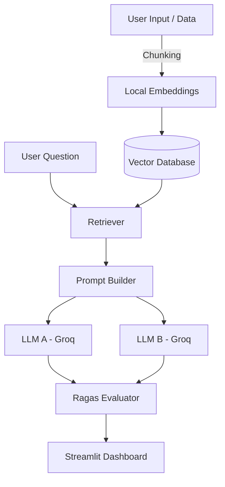

# 🦑 RAGEval: AI Data Pipeline Evaluator

[](https://opensource.org/licenses/MIT)
[](https://www.python.org/downloads/)
[](https://haystack.deepset.ai/)
[](https://docs.ragas.io/)
[](https://groq.com/)

**RAGEval** is an open-source Developer Tool built for Data Scientists and AI Engineers. It allows you to rapidly build, evaluate, and compare different Large Language Models (LLMs) and Retrieval-Augmented Generation (RAG) strategies directly on your own custom data.

Stop guessing which model performs best for your specific use-case. Compare them objectively with **Ragas** metrics!

---

## ✨ Key Features (v2.0)
- 🚀 **Blazing Fast Inference:** Powered by the [Groq API](https://groq.com/), enabling you to evaluate open-source models like `Llama 3` and `Mixtral` in milliseconds.
- 📄 **PDF & Document Support:** Drag and drop PDF files directly into the UI to be chunked and indexed automatically!
- 💾 **ChromaDB Persistent Storage:** Your vector embeddings are now saved locally using `ChromaDB`, meaning you don't have to re-upload data on every run.
- 🌐 **Agentic Web Search Fallback:** If the provided documents don't contain the answer, the pipeline automatically searches the live internet (via DuckDuckGo) to find the answer!
- 🔒 **Privacy-First (Local Embeddings):** Uses local HuggingFace embedding models (`all-MiniLM-L6-v2`) by default.
- 📐 **Ragas Evaluation:** Built-in integration with the [Ragas Framework](https://docs.ragas.io/) to objectively score:
  - **Faithfulness:** Measures if the answer is completely derived from the given context (no hallucinations).
  - **Answer Relevancy:** Measures how directly the answer addresses the user's prompt.
- 📥 **CSV Reporting:** Export your evaluation results (Ragas scores) instantly to a CSV file.
- 📊 **Beautiful Web UI:** Interactive frontend built with [Streamlit](https://streamlit.io/) featuring real-time data visualization.

---

## 🎥 Live Demo / Screenshots
*(Add your GIF or screenshot here)*
To test the tool quickly, you can use the provided `demo/sample.pdf` file!

---

## 🏗️ Architecture



---

## 🚀 Installation & Quick Start

### 1. Clone the Repository
```bash
git clone https://github.com/karidasd/llm-rag-evaluator.git
cd llm-rag-evaluator
```

### 2. Install Dependencies
It is highly recommended to use a virtual environment:
```bash
python -m venv venv
# On Windows:
venv\Scripts\activate
# On Mac/Linux:
source venv/bin/activate

pip install -r requirements.txt
```

### 3. Setup API Keys
RAGEval utilizes Groq for completely free, lightning-fast inference.
1. Get your free API key at [console.groq.com](https://console.groq.com/keys).
2. Copy the `.env.example` file and rename it to `.env`.
3. Add your key:
```env
GROQ_API_KEY=gsk_xxxxxxxxxxxxxxxxxxx
```
*(Alternatively, you can paste the key directly into the app's sidebar during runtime).*

### 4. Run the Application
```bash
streamlit run app.py
```
The dashboard will automatically open in your default browser at `http://localhost:8501`.

---

## 🧠 Supported Models
By default, the application is configured to compare:
- `llama3-8b-8192`
- `llama3-70b-8192`
- `mixtral-8x7b-32768`
- `gemma-7b-it`

*Note: You can easily add more OpenAI-compatible endpoints or models in `app.py`.*

## 🤝 Contributing
Contributions are more than welcome! Whether it's adding new Ragas metrics (Context Precision, Context Recall), integrating new Vector Databases, or improving the UI. Please feel free to open an Issue or submit a Pull Request.

## 📄 License
This project is open-source and available under the MIT License.
